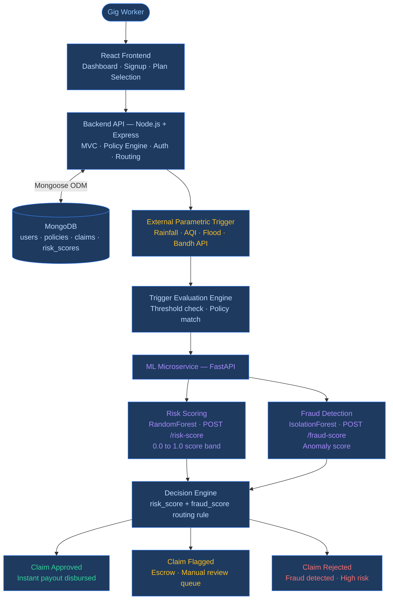
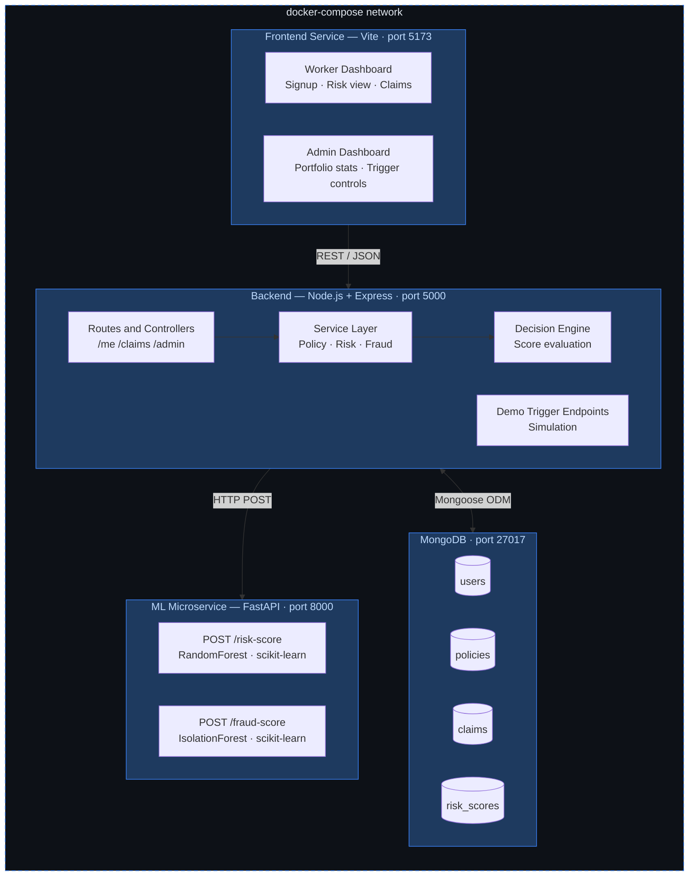
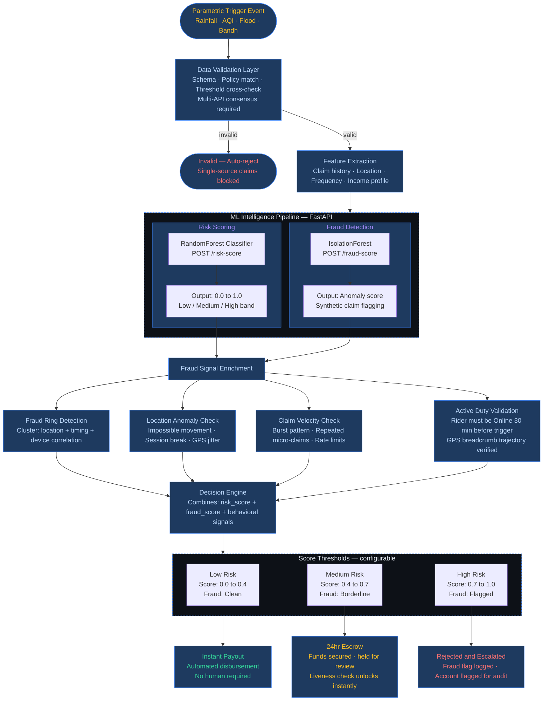

# ⚡ GigShield AI: Parametric Income Protection for India's Gig Workers

**Guidewire DEVTrails 2026 - Phase 1 Submission**

**Theme:** Ideate and Know Your Delivery Worker · **Round:** Market Crash Crisis Response

**Team:** CODEpreneurs · Aditya Nair · Soumya Snehal · Animesh Gupta · Apurva Singh

[](LICENSE)
[](.)
[](.)
[](.)

[](https://www.figma.com/make/8Ta29yUCELZIH7RIHZlKA5/GigShield-AI-UI-Design?p=f&t=wfJk3Q4EGmUzAU7b-0&fullscreen=1)
[](https://youtu.be/mUygqU4H2_w)

> **GigShield AI** is a zero-touch parametric income protection platform built for India's 15M+ gig workers, engineered from the ground up to survive coordinated fraud rings, GPS spoofing, and mass claim attacks without ever missing a legitimate payout.

---

## 📌 Table of Contents

1. [The Problem and Persona](#1--the-problem-and-persona)
2. [The Solution](#2--the-solution)
3. [Persona Scenario — Meet Ravi](#3--persona-scenario--meet-ravi)
4. [Financial Architecture and Workflow](#4--financial-architecture-and-workflow)
5. [Parametric Triggers](#5--parametric-triggers)
6. [AI and Machine Learning Layer](#6--ai-and-machine-learning-layer)
7. [System Architecture](#7--system-architecture)
8. [Adversarial Defense and Anti-Fraud Engine](#8--adversarial-defense-and-anti-fraud-engine)
9. [User Experience Flow](#9--user-experience-flow)
10. [Why GigShield Stands Apart](#10--why-gigshield-stands-apart)
11. [Tech Stack](#11--tech-stack)
12. [Repository Structure](#12--repository-structure)
13. [Phase 1 Scope](#13--phase-1-scope)

---

## 1. 🎯 The Problem and Persona

**The Persona:** Urban gig delivery workers on Swiggy, Zomato, Blinkit, and Uber whose entire income depends on being able to ride and deliver every single day.

**The Core Vulnerability:** India's gig workers operate with zero financial safety net. When a disruption hits, their income stops instantly. There is no sick leave. No severance. No fallback. They absorb 100% of the financial shock alone.

| Disruption | What Happens to the Worker |
|---|---|
| Heavy rainfall | Deliveries halt. Bikes stall on flooded roads. Orders cancelled. |
| Waterlogged zones | Complete mobility loss. Zero earnings for the entire window. |
| Extreme AQI / pollution | Platform-mandated health stops. No rides, no income. |
| Curfews / Bandhs | Dark stores go offline instantly. Riders stranded with no warning. |

> **The gap is structural.** Traditional insurance is built for salaried employees. It requires manual claims, takes days to pay out, and assumes workers have the time and literacy to navigate the process. Gig workers have none of that.

---

## 2. 💡 The Solution

GigShield AI introduces a **zero-touch parametric insurance model** built specifically for the gig economy.

```
Monitor real-world conditions
        ↓
Detect trigger events automatically
        ↓
Evaluate eligibility via AI (risk + fraud scoring)
        ↓
Pay out instantly — no forms, no adjusters, no waiting
```

If the disruption is objectively real, the payout is automatic. Unlike traditional insurance which pays based on what you *claim*, parametric insurance pays based on what *actually happened*, verified by independent real-world data sources.

| Traditional Insurance | GigShield AI |
|---|---|
| Manual claim submission | Zero-touch automated trigger |
| Days to weeks for payout | Instant disbursement |
| Human adjuster verification | AI + multi-API consensus |
| Annual or monthly premiums | Weekly micro-premiums (Rs. 20 to Rs. 45) |
| Binary: covered or not | Risk-scored, tiered payout routing |

---

## 3. 🚴 Persona Scenario — Meet Ravi

**Ravi** is a delivery partner in Bengaluru. He works 10 hours a day, earns Rs. 800 to Rs. 1,200 on a good day, and has no savings buffer.

| Step | What Happens |
|---|---|
| **Onboarding** | Ravi signs up, selects his zone, and picks a weekly plan. AI profiles his zone's historical risk. |
| **Coverage** | His premium is set at Rs. 35 for the week, dynamically calculated from the 7-day forecast. |
| **Disruption** | Tuesday 3pm: rainfall in Bengaluru South exceeds 15mm/hr. Roads start flooding. Ravi cannot ride. |
| **System Action** | GigShield detects the trigger via weather + traffic APIs, ML scores the risk, fraud check passes, eligibility confirmed. |
| **Outcome** | Claim auto-triggered. Rs. 200 payout initiated. No form filled. No call made. No adjuster involved. |

> Ravi's phone buzzes: *"Rain disruption confirmed in your zone. Rs. 200 has been credited for 2 lost hours."*
> He never filed anything. The system did it for him.

---

## 4. 💰 Financial Architecture and Workflow

GigShield operates on a **weekly micro-premium model** designed around how gig workers actually earn and spend. Annual or monthly premiums are financially unviable for this demographic. Weekly premiums align with their payout cycles.

| Parameter | Detail |
|---|---|
| Coverage window | 7 days, renews every Monday |
| Base premium | Rs. 20/week, dynamically adjusted by AI risk score each Sunday night |
| Payout rate | Rs. 100 per hour of verified disruption |
| Daily cap | Rs. 300/day, protects the liquidity pool from city-wide events |
| Weekly cap | Rs. 1,000/week |
| Payout mechanism | Fully automated, no human approval required |

> **Why caps?** Parametric insurance is micro-insurance, not disaster relief. Caps protect the shared liquidity pool so that everyday disruptions are always covered for everyone.

### Diagram 1 — End-to-End Workflow: User to Payout



---

## 5. ⚡ Parametric Triggers

GigShield uses **multi-API consensus** so no single data source can fire a payout on its own. Every trigger needs at least two independent signals to agree before the system acts.

| # | Trigger Type | Condition | Sources Required |
|---|---|---|---|
| 1 | Rainfall / Flooding | Rainfall > 15mm/hr AND road speed < 8 km/h in zone | OpenWeather API + Traffic API |
| 2 | Extreme Pollution | AQI > 300 (hazardous band) | CPCB / AQI API |
| 3 | Flood Zone Alert | Regional flood alert active for worker's PIN code | Disaster Management API |
| 4 | Curfew / Bandh | NLP scraper detects strike AND dark store confirmed offline | News NLP + Platform API |

A single compromised or faulty API cannot cause fraudulent mass payouts. This is a core architectural decision, not a feature.

---

## 6. 🧠 AI and Machine Learning Layer

GigShield's ML intelligence runs as a **fully independent FastAPI microservice**, completely decoupled from the backend, independently scalable, and swappable without touching core business logic.

### Risk Scoring

Answers the question: *"How likely is it that a real disruption is affecting this worker right now?"*

**Algorithm:** RandomForest Classifier
**Inputs:** Rainfall intensity, AQI level, flood probability, worker claim history, zone historical data
**Output:** Continuous risk score from `0.0` (no risk) to `1.0` (maximum risk)
**Endpoint:** `POST /risk-score`

### Fraud Detection

Answers the question: *"Does this claim look like it came from a real stranded worker, or is it synthetic?"*

**Algorithm:** IsolationForest (unsupervised anomaly detection)
**Inputs:** Claim metadata, GPS location, claim timing, device fingerprint, behavioral signals
**Output:** Anomaly score that flags claims deviating from legitimate patterns
**Endpoint:** `POST /fraud-score`

IsolationForest is specifically chosen because fraud patterns in parametric insurance are unknown in advance. Supervised models need labelled fraud data which does not exist at launch. IsolationForest finds anomalies without pre-labelled examples.

---

## 7. 🏗️ System Architecture

GigShield is a **four-service microservice architecture** fully orchestrated via Docker Compose. Every service is independently containerised, communicates over a shared internal network, and can be scaled independently.

### Diagram 2 — Microservices Architecture



| Service | Role | Port |
|---|---|---|
| React + Vite | Worker dashboard, Admin dashboard, Plan selection UI | `5173` |
| Node.js + Express | API gateway, Policy engine, Trigger evaluation, Decision logic | `5000` |
| FastAPI (Python) | Risk scoring, Fraud detection, ML model serving | `8000` |
| MongoDB | Persistent storage for users, policies, claims, risk scores | `27017` |

---

## 8. 🚨 Adversarial Defense and Anti-Fraud Engine

> **The Market Crash Scenario:** 500 delivery partners. Fake GPS. Real payouts. A coordinated fraud ring just drained a platform's liquidity pool. Simple GPS distance checks are dead. How does GigShield fight back?

### The Threat Model

| Attack Vector | Method | Scale |
|---|---|---|
| **GPS Spoofing** | Mock location to fake being inside a triggered zone | Individual |
| **Fraud Rings** | Coordinated mass claims via Telegram groups | Syndicate, 50 to 500 actors |
| **Replay Attacks** | Claims filed outside trigger windows using captured API data | Automated bots |
| **Claim Velocity Abuse** | Burst micro-claims to drain the pool before detection fires | Botnet |
| **Opportunistic Logins** | Logging in after a trigger fires to retroactively qualify | Individual |

### Diagram 3 — Anti-Fraud and Decision Engine Pipeline



### Seven-Layer Defense

**Layer 1 — Data Validation:** At least two independent sources must confirm a trigger. Single-source signals are auto-rejected. Replay attacks fail because trigger windows are time-bound and cross-validated against live feeds.

**Layer 2 — Location Consistency:** GPS breadcrumbs are traced throughout every active session. Teleportation patterns (12km in 45 seconds) flag the session immediately. GPS jitter analysis separates genuine network drops from artificially constructed spoofed streams.

**Layer 3 — Active Duty Validation:** A worker must be confirmed `Online` on their platform at least 30 minutes before the trigger fires. Workers who login after seeing news of a rainstorm are blocked at this gate. You cannot claim income you were not earning.

**Layer 4 — Behavioral Monitoring:** Per-worker, per-zone, and per-device rate limits on claim frequency. A sudden spike in claims from the same zone triggers automatic zone-level escrow — payouts are held, not cancelled, while the anomaly is evaluated.

**Layer 5 — ML Fraud Detection:** The IsolationForest model is trained on behavioral signatures of legitimate claims. Synthetic claims filed at inhuman speed with pixel-perfect identical GPS coordinates score as outliers and are blocked before the payout gate.

**Layer 6 — Fraud Ring Detection:** Claims are mapped in real time as a behavioral network graph. When clusters exceed the threshold (10+ nodes with high edge density sharing GPS coordinates, device fingerprints, or Wi-Fi BSSIDs) they are classified as fraud rings and escalated for audit.

**Layer 7 — Reputation and Escrow:** Workers with clean histories are processed faster. Flagged claims are not hard-rejected — funds are secured in 24hr Escrow and workers receive a clear explanation. A Liveness Check (live photo with EXIF metadata) overrides the AI flag and releases funds immediately.

> **Core design principle:** The system must be as hard on fraud rings as it is gentle on genuine workers. An honest stranded worker who loses their payout because of an overly aggressive filter is just as bad an outcome as a fraud ring that succeeds.

### Attack Simulation: Monsoon Fraud Ring

```
ATTACK:    200 claims in 90 seconds
           Identical GPS coordinates to 6 decimal places
           All accounts registered in the past 72 hours

LAYER 2:   No prior movement detected — trajectory fails for 180 of 200
LAYER 3:   94 accounts logged in after trigger fired — all blocked
LAYER 4:   200 claims in 90s from same zone — zone escrow triggered
LAYER 5:   IsolationForest anomaly score > 0.82 — fraud gate fires
LAYER 6:   Graph cluster confirmed — 200 accounts escalated for audit

RESULT:    180 fraud claims blocked
           20 genuine workers with clean histories receive instant payout
           Liquidity pool protected — zero manual intervention
```

---

## 9. 🎨 User Experience Flow

GigShield is built for workers who are not tech-savvy. The entire worker flow is designed to be understood in under 30 seconds.

### Worker Flow

| Stage | What the Worker Does |
|---|---|
| **Signup** | Enters city, platform, and weekly income. Takes under 2 minutes. |
| **Plan Selection** | AI shows their zone's current risk score and recommends a plan. Worker taps to confirm. |
| **Active Coverage** | Dashboard shows policy status, risk score, and claim history at a glance. |
| **During Disruption** | Worker receives a push alert: *"Heavy rainfall detected in your area. You are covered."* |
| **After Disruption** | Payout shows in claims history as Approved, or as Under Review if flagged for fraud check. |

No jargon. No forms. No follow-up calls. The product works *for* the worker, not the other way around.

### Admin Experience

Admins get a real-time dashboard with portfolio metrics, zone-level risk heatmaps, fraud monitor with cluster visualisations, and a trigger simulation panel to test the system end-to-end during demos.

---

## 10. 🏆 Why GigShield Stands Apart

> What happens when 200 delivery partners lose 4 hours of income due to a sudden rainstorm?
> **Today:** They earn nothing and have no recourse.
> **With GigShield:** They get paid automatically, without filing a single claim.

Most hackathon solutions for gig worker protection stop at the idea level. GigShield is already a functional system prototype.

| What Others Do | What GigShield Does |
|---|---|
| Describe a concept | Ship a working four-service architecture |
| Assume fraud is simple | Build a seven-layer adversarial defense system |
| Use a single ML model | Run parallel risk scoring AND fraud detection |
| Build one dashboard | Deliver separate worker and admin experiences |
| Ignore edge cases | Design explicitly for GPS spoofing and fraud rings |

**The differentiators in plain terms:**

- End-to-end working architecture, not just a concept deck
- Integrated ML pipeline with two independent models (risk + fraud)
- Adversarial fraud defense designed for real syndicate-scale attacks
- Real-time parametric trigger system with multi-API consensus
- Dual dashboards for worker and admin, both fully functional

---

## 11. 🛠️ Tech Stack

| Layer | Technology | Purpose |
|---|---|---|
| Frontend | React 18 + Vite | Worker dashboard, Admin dashboard |
| Backend | Node.js + Express.js | API gateway, Policy engine, Decision logic |
| ML Service | Python + FastAPI | Risk scoring and fraud model serving |
| Risk Model | scikit-learn RandomForest | Premium adjustment, Trigger validation |
| Fraud Model | scikit-learn IsolationForest | Anomaly detection, Pre-payout fraud gate |
| Database | MongoDB + Mongoose ODM | Persistent storage for all domain entities |
| Data Processing | pandas + numpy | Feature engineering in ML service |
| Infrastructure | Docker + docker-compose | Four-service container orchestration |

---

## 12. 📁 Repository Structure

```
gigshield-ai/
│
├── backend/                           # Node.js + Express API
│   ├── controllers/
│   │   ├── workerController.js        # /me · /claims · /risk-score
│   │   └── adminController.js         # analytics · trigger management
│   ├── models/
│   │   ├── User.js
│   │   ├── Policy.js
│   │   ├── Claim.js
│   │   └── RiskScore.js
│   ├── routes/
│   │   ├── workerRoutes.js
│   │   └── adminRoutes.js
│   ├── services/
│   │   ├── policyService.js           # weekly premium logic
│   │   ├── riskService.js             # ML risk score integration
│   │   ├── fraudService.js            # fraud score integration
│   │   └── triggerService.js          # parametric trigger evaluation
│   └── server.js
│
├── frontend/                          # React + Vite
│   └── src/
│       ├── pages/
│       │   ├── WorkerDashboard.jsx
│       │   └── AdminDashboard.jsx
│       └── components/
│
├── ml-service/                        # Python FastAPI ML microservice
│   ├── main.py                        # FastAPI entrypoint
│   ├── risk_model.py                  # RandomForest risk scorer
│   └── fraud_model.py                 # IsolationForest fraud detector
│
├── docker-compose.yml
├── LICENSE
└── README.md
```

---

## 13. 📋 Phase 1 Scope

### What We Built

- [x] Backend MVC architecture — Node.js + Express
- [x] Worker API: `/me` · `/claims` · `/risk-score`
- [x] Admin API: analytics routes and trigger management
- [x] Demo parametric trigger endpoints — rainfall, AQI, flood simulation
- [x] ML microservice — Risk scoring via RandomForest (`POST /risk-score`)
- [x] ML microservice — Fraud detection via IsolationForest (`POST /fraud-score`)
- [x] Fraud scoring integrated into the decision pipeline
- [x] Frontend — Worker dashboard (signup → plan → risk view → claims)
- [x] Frontend — Admin dashboard (portfolio stats + trigger simulation)
- [x] MongoDB schema — users, policies, claims, risk scores
- [x] Docker + docker-compose multi-service orchestration
- [x] Seven-layer adversarial defense architecture — design and foundation

### What is Next (Phase 2)

- [ ] Live OpenWeather / CPCB AQI API integration
- [ ] Real-time auto-trigger engine with continuous polling
- [ ] Razorpay sandbox for simulated UPI instant payouts
- [ ] Graph ML fraud ring detection at production scale
- [ ] Reputation scoring for verified long-term users
- [ ] Cloud deployment on AWS or GCP

---

## Phase 1 Deliverables

| Deliverable | Link |
|---|---|
| Demo Video (2 min) | [](https://youtu.be/mUygqU4H2_w) |
| Figma UI Mockups | [](https://www.figma.com/make/8Ta29yUCELZIH7RIHZlKA5/GigShield-AI-UI-Design?p=f&t=wfJk3Q4EGmUzAU7b-0&fullscreen=1) |
| GitHub Repository | [](https://github.com/Adinair01) |

---

<div align="center">

## 🚀 Vision

GigShield AI is building a real-time, transparent, and resilient income protection system for the workers who power India's urban economy.

> *"From unpredictable streets to predictable income."*

---

Built by **Aditya Nair · Soumya Snehal · Animesh Gupta · Apurva Singh**
Team CODEpreneurs · Guidewire DEVTrails 2026

[](https://github.com/Adinair01)

</div>
